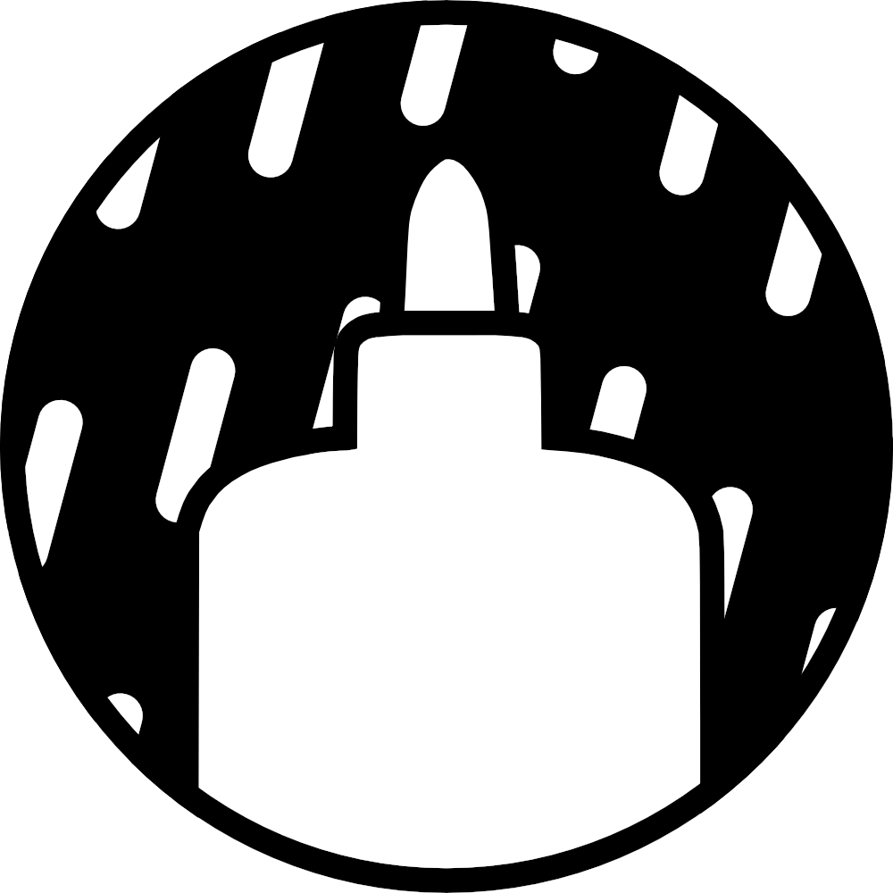

<h1 align="center">

Gluno
</h1>

Gluon 🕯 + Deno 🦕

## About Gluno

Gluno is a fork of Glu<u>on</u>. Which aims to provide more Deno-ish runtime
support.\
For more details about Glu<u>on</u>, please see
[upstream's readme](https://github.com/gluon-framework/gluon) or
[their website](https://gluonjs.org/).\
But here's simple explanation what Glu<u>on</u> is.

- Gluon is a new framework for creating desktop apps from websites.
- Gluon uses system installed browsers, not bundled browser or system webviews.
  - You have installed Chrome, Edge, Firefox (and Chromium-based) browser for
    daily uses isn't it?
  - Then why you have to use bundled browser or additional installed webview for
    running every single app?

## Gluno's Objective

- Support latest upstream Gluon
- Use typescript and provide types
- Follow the philosophy of Deno

## Current development environments
as of 2023/02/24 - katabame

| Repository / Software                                             | Commit SHA / Version                     |
|-------------------------------------------------------------------|------------------------------------------|
| [Gluon](https://github.com/gluon-framework/gluon/tree/main)       | 86b7bfc14ae7218ae9eb7b58b0fc4a26df389c58 |
| [Gluworld](https://github.com/gluon-framework/examples/tree/main) | 42a06ddfaeee4b8a5128053409e9f1cf67fc6548 |
| VisualStudio Code                                                 | 1.75.1                                   |
| Deno for VisualStudio Code Extension                              | 3.17.0                                   |
| Deno                                                              | 1.30.3                                   |
| Deno V8                                                           | 10.9.194.5                               |
| Deno Typescript                                                   | 4.9.4                                    |
| Windows 11                                                        | 22H2                                     |

## (Not) Frequently Asked Questions
- Why you use 🕯 emoji next to Gluon?
  - When I was starting this fork, I assumed Gluon's logo is a candle. (maybe it is a glue....)
- Where Gluno name cames from?
  - It's quite simple. Glu<u>on</u> + De<u>no</u>, just swapped last two letters.
